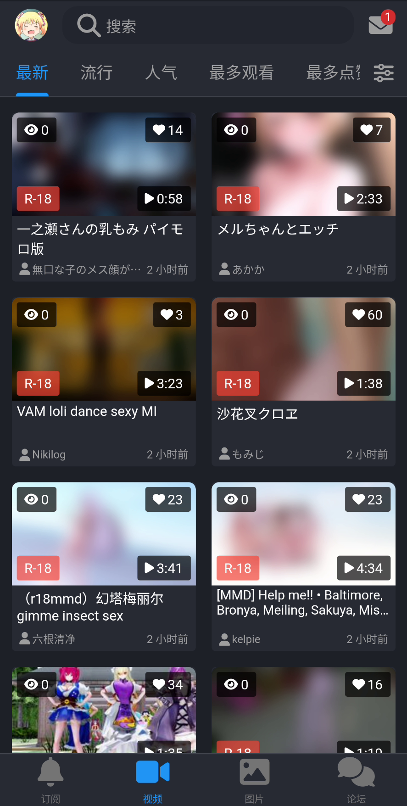
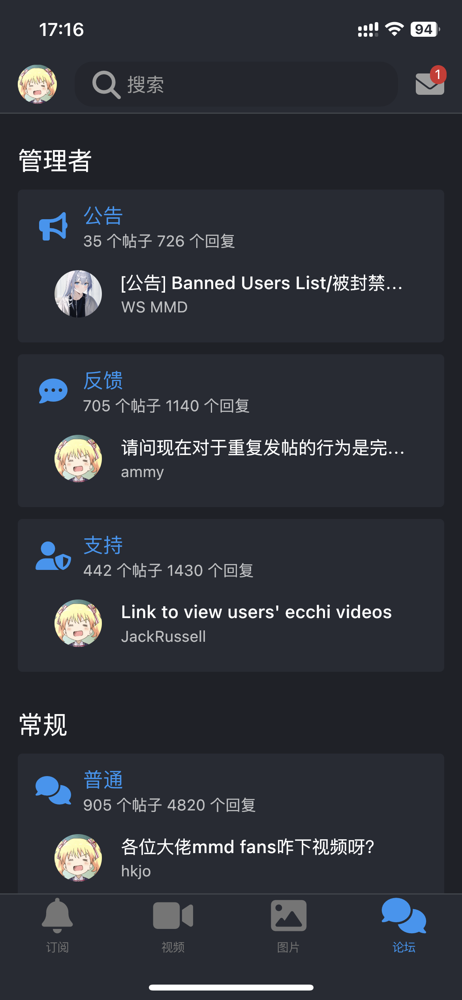

# IwrQk 

IwrQk is a cross-platform application based on Flutter that is compatible with the new version of Iwara (a video sharing platform).

Now with [Material Design 3](https://m3.material.io/).

## 🚩 Features

 - ✅ Download manager (Only for videos)
 - ✅ Friends manager
 - ⬜ Notification and message manager 
 - ✅ Follow, subscription, favorite, playlist, comments
 - ✅ Forum
 - ✅ Player and gallery viewer
 - ✅ Login, logout, register
 - ✅ Blocklist for tags
 - ⬜ Advanced search

## 📱 Screenshots

|  |  |  | 
|:---:|:---:|:---:|

## 💻 Contributions

If you are a developer eager to contribute to this project, feel free to submit a pull request! The project also utilizes `slang` for localization, and [contributions to translation](/lib/i18n/strings.i18n.json) are appreciated.

In case you come across any bugs, please report them after ensuring they are not caused by network issues, as Iwara's servers may encounter errors.

Let's collaborate to enhance the Iwara experience together!

Special thanks to [guozhigq/pilipala](https://github.com/guozhigq/pilipala) for the inspiration and player implementation.